<!-- Profile README -->

  <picture>
    <source media="(prefers-color-scheme: dark)" srcset="./dark.svg">
    
  </picture>

<!-- One-line anchors: GitHub draws link underlines on whitespace between badges -->

  &#160;&#160;

---

### About

Senior frontend engineer building product interfaces, microfrontend platforms, and developer tooling.  
~7 years shipping web apps — from MVP to high-load systems. Curious about AI engineering and automation in the craft of software.

- **Focus:** Frontend Architecture · AI Engineering · Automation
- **Background:** Control Systems Engineering · ROAT
- **Based in:** Moscow, RU
- **Say hi:** [t.me/ivan_sukhachev](https://t.me/ivan_sukhachev)

---

### Tech Stack

